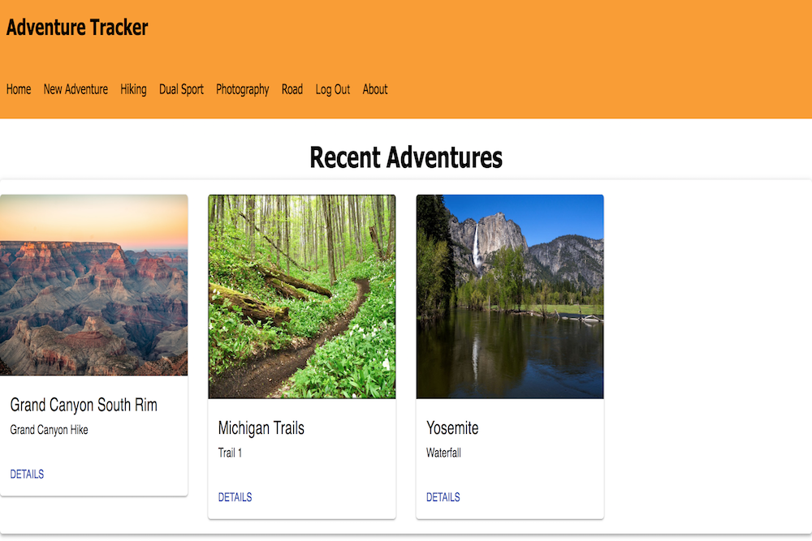

# Adventure Tracker
This application uses React, Redux, Express, Passport, and PostgreSQL (a full list of dependencies can be found in `package.json`). This app is used to input GPS tracking data to save adventures and display the locations on google maps. 

## Prerequisites

Before you get started, make sure you have the following software installed on your computer:

- [Node.js](https://nodejs.org/en/)
- [PostrgeSQL](https://www.postgresql.org/)
- [Nodemon](https://nodemon.io/)

## Development Setup Instructions

* Run `npm install`
* brew services start postgresql`
* Create Database from database.sql
* Run `npm run server`
* Run `npm run client`
* Navigate to `localhost:3000`

Once the project is up and running register an account and login. You will then be greeted with this homepage. 

